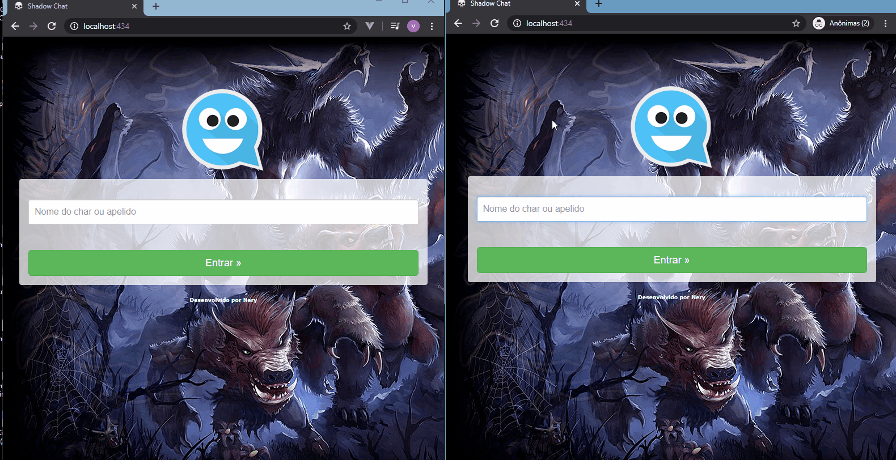

# Multiroom Chat

> O projeto consiste em um chat onde diversos usuários podem se conectar ao mesmo tempo, além disso, um usuário possui uma senha que permite que o mesmo se conecte ao chat como administrador e suas mensagens sejam diferenciadas das mensagens dos demais usuários. Utilizo Node.js e socket.io neste projeto, layout responsivo. 
<hr>


## Instalação

Windows:

Execute os seguintes comandos e depois se conecte a (http://localhost:434):

```sh
npm i
npm update
node app
```

Senha Admin: 8291admin23

## Meta

Vinicius Nery – [@Linkedin](https://www.linkedin.com/in/marcos-nery-a3012/) – Viniciusneryb13@hotmail.com

[https://github.com/Nery37](https://github.com/Nery37)
